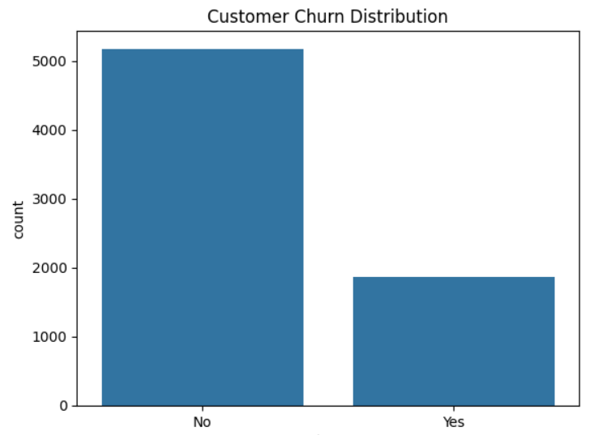
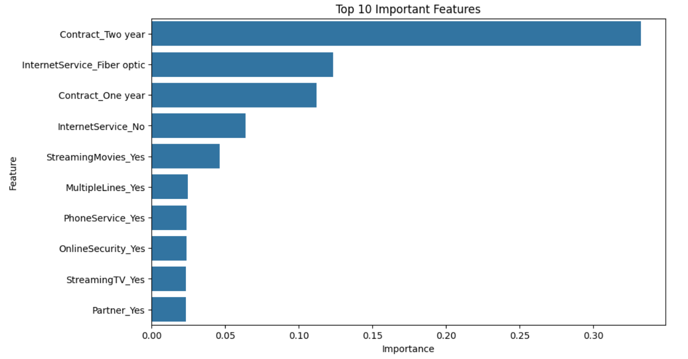

# Customer-Churn-Prediction

# Customer Churn Prediction using Machine Learning

## 📌 Project Overview

This project predicts customer churn using Machine Learning techniques.  
The goal is to identify customers who are likely to leave a company, enabling businesses to improve customer retention strategies.

The project includes:
- Exploratory Data Analysis (EDA)
- Data preprocessing
- Handling imbalanced data using SMOTE
- Model training and evaluation
- Feature importance analysis

---

## 📊 Dataset

Dataset used:
- Telco Customer Churn Dataset

Source:
https://www.kaggle.com/datasets/blastchar/telco-customer-churn

The dataset contains customer information such as:
- Contract type
- Monthly charges
- Internet services
- Tenure
- Payment methods
- Churn status

---

## 🛠 Technologies Used

- Python
- pandas
- NumPy
- scikit-learn
- XGBoost
- matplotlib
- seaborn
- imbalanced-learn (SMOTE)

---

## 🔍 Exploratory Data Analysis

Performed analysis to identify churn patterns and customer behavior.

Key findings:
- Customers with month-to-month contracts showed higher churn rates
- Higher monthly charges were associated with increased churn probability
- Customers with shorter tenure were more likely to churn

---

## ⚙️ Data Preprocessing

Steps performed:
- Handled missing values
- Converted data types
- Applied one-hot encoding
- Scaled numerical features using StandardScaler
- Split data into training and testing sets

---

## ⚖️ Handling Imbalanced Data

The dataset showed class imbalance.

To improve model performance:
- SMOTE (Synthetic Minority Oversampling Technique) was applied to the training dataset.

---

## 🤖 Machine Learning Models

The following models were trained and evaluated:

1. Logistic Regression
2. Random Forest
3. XGBoost

Evaluation metrics:
- Accuracy
- Precision
- Recall
- F1-Score
- ROC-AUC

---

## 📈 Model Performance

| Model | ROC-AUC Score |
|------|------|
| Logistic Regression | 0.78 |
| Random Forest | 0.72 |
| XGBoost | 0.73 |

XGBoost achieved the best performance and was selected as the final model.

---

## 📌 Feature Importance

Feature importance analysis identified the following key churn drivers:
- Contract type
- Monthly charges
- Customer tenure

---

## 📷 Visualizations

### Churn Distribution



### Feature Importance


---

## 🚀 Business Impact

This project demonstrates how Machine Learning can help businesses:
- Predict customer churn
- Improve retention strategies
- Reduce customer loss
- Support data-driven decision-making

---

## 📂 Project Structure

```text
customer-churn-prediction/
│
├── data/
├── notebooks/
├── visuals/
├── models/
├── README.md
├── requirements.txt
```
---

## 👤 Author

Md Kamruzzaman
